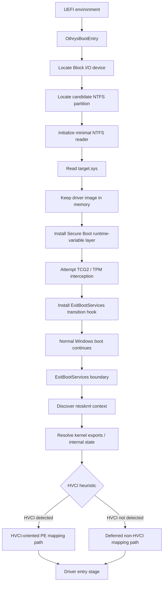

# Othrys

> Experimental UEFI / Windows boot research project.


> [!WARNING]
> **Othrys is unfinished and currently contains significant bugs and architectural limitations.**
>
> The repository should be treated as an experimental research codebase, not as a stable or production-ready implementation.

## Overview

Othrys is an experimental EDK II UEFI driver exploring the transition between the firmware boot environment and the Windows kernel.

The current codebase contains components for:

- direct NTFS access from UEFI;
- loading a Windows kernel driver image into memory;
- PE parsing and relocation;
- Windows kernel discovery and export resolution;
- UEFI runtime-variable interception;
- Secure Boot state virtualization/spoofing experiments;
- EFI TCG2 / TPM PCR7 response experiments;
- separate HVCI and non-HVCI-oriented mapping paths;
- boot-to-kernel transition experimentation.

The project is implemented as an EDK II `UEFI_DRIVER` with:

```text
ENTRY_POINT = OthrysBootEntry
```

## Current Status

**Status: 🚧 Work in Progress**

Othrys is currently an implementation prototype.

Several important pieces are incomplete or unreliable, and some current implementation details are known to be incorrect.

Do **not** assume that:

- the project works on arbitrary hardware;
- the project works across Windows builds;
- HVCI compatibility is complete;
- Secure Boot state handling is generic;
- TPM behaviour is portable across systems;
- kernel discovery is stable;
- NTFS volume discovery is reliable;
- the current PE loader correctly handles arbitrary Windows drivers.

Breaking changes should be expected.

---

# Architecture

At a high level, Othrys is split into three stages:

```text
Firmware / UEFI
      │
      ▼
Othrys initialization
      │
      ├── disk / NTFS discovery
      ├── target.sys acquisition
      ├── Secure Boot runtime layer
      └── TCG2 runtime layer
      │
      ▼
UEFI → Windows transition
      │
      ▼
Kernel discovery / mapping stage
      │
      ├── HVCI-oriented path
      └── non-HVCI-oriented path
```

## Execution Flow

The current source code follows approximately this flow:



---

# Boot Stage

## `main.c`

`main.c` contains the main orchestration logic.

The UEFI entry point is:

```text
OthrysBootEntry
```

Its current responsibility is roughly:

```text
Find block device
        │
        ▼
Find NTFS partition
        │
        ▼
Initialize NTFS
        │
        ▼
Read target.sys
        │
        ▼
Install Secure Boot layer
        │
        ▼
Attempt TCG2 hook
        │
        ▼
Install mapper transition hook
```

The target driver path is currently hardcoded as:

```text
\Windows\System32\drivers\target.sys
```

This means Othrys is not currently a generic driver-selection framework.

---

# Storage Layer

## `ntfs.c`

Othrys contains its own small NTFS reader instead of relying entirely on a mounted UEFI filesystem.

The implementation handles parts of:

- raw Block I/O access;
- GPT / MBR inspection;
- NTFS boot-sector parsing;
- MFT access;
- Update Sequence Array fixups;
- NTFS attributes;
- directory indexes;
- resident data;
- non-resident data;
- data runs;
- path traversal.

The NTFS layer is intentionally much smaller than a complete NTFS implementation.

Its main purpose in the current architecture is obtaining the target driver before the Windows kernel is fully active.

---

# Secure Boot Runtime Layer

## `secureboot.c`

The Secure Boot component intercepts selected UEFI runtime variable operations.

The implementation maintains cached representations of variables including:

```text
SecureBoot
SetupMode
AuditMode
DeployedMode
CustomMode

PK
KEK

db
dbx
dbt
dbr

MokList
SbatLevel
SignatureSupport
```

It replaces selected Runtime Services handlers while the layer is active.

Conceptually:

```text
Windows / boot component
        │
        ▼
UEFI Runtime GetVariable
        │
        ▼
Othrys variable layer
        │
        ├── selected variable → cached representation
        │
        └── other variable    → original firmware service
```

Writes to selected protected variables are rejected while this layer is enabled.

The project currently uses static platform-specific data stored in:

```text
include/sb_variables.h
```

Those values must **not** be considered portable or valid for arbitrary systems.

---

# TPM / TCG2 Layer

## `tcg2hook.c`

Othrys locates the EFI TCG2 protocol and wraps its command submission path.

The current experiment identifies PCR read traffic involving PCR7 and modifies the returned representation using the configured PCR7 data.

Conceptually:

```text
PCR request
    │
    ▼
EFI_TCG2_PROTOCOL
    │
    ▼
Original TPM command
    │
    ▼
TPM response
    │
    ▼
Othrys response layer
    │
    ▼
Caller
```

The current parser is deliberately minimal and should not be treated as a complete TPM2 command/response implementation.

---

# Windows Kernel Discovery

## `memscan.c`

`memscan.c` is responsible for locating and inspecting Windows kernel state.

The current implementation includes logic for:

- enumerating selected UEFI memory ranges;
- searching for a PE image matching `ntoskrnl.exe`;
- parsing kernel PE sections;
- resolving exported kernel functions;
- locating selected internal kernel structures;
- signature / pattern based discovery;
- detecting candidate writable areas;
- performing the current HVCI heuristic.

Some resolved symbols include functions related to kernel memory allocation and loaded-module state.

This component is particularly sensitive to:

- Windows build changes;
- PE layout changes;
- kernel implementation changes;
- memory protections;
- firmware memory-map behaviour.

---

# Mapper

## `mapper.c`

The mapper coordinates the firmware-to-kernel transition.

Before the UEFI boot-services transition, the driver image is retained in runtime-accessible memory.

A transition hook is installed around the `ExitBootServices` stage.

The intended high-level sequence is:

```text
target.sys in UEFI memory
          │
          ▼
ExitBootServices transition
          │
          ▼
Locate Windows kernel
          │
          ▼
Resolve required kernel state
          │
          ▼
Determine mapping strategy
       ┌──┴──┐
       │     │
      HVCI  non-HVCI
       │     │
       └──┬──┘
          ▼
   mapped driver stage
```

The code currently contains different experimental paths depending on the result of its HVCI heuristic.

---

# PE Loader

## `efi_pe_loader.c`

The custom PE loader implements parts of manual PE image handling:

```text
raw PE
  │
  ├── validate DOS / NT headers
  │
  ├── allocate image memory
  │
  ├── copy sections
  │
  ├── apply base relocations
  │
  ├── resolve imports
  │
  └── determine entry point
  │
  ▼
mapped image
```

Kernel module resolution uses the loaded-module list and PE export tables.

## `pe_parser.c`

Contains additional reusable PE utilities for:

- parsing PE32 / PE32+ headers;
- applying relocation records;
- resolving exports by name.

---

# Deferred Kernel Stage

## `shellcode.c`

The non-HVCI-oriented path contains a small deferred execution stage intended to finish driver mapping once the required Windows kernel environment is available.

Its responsibilities include parts of:

- kernel memory allocation;
- PE processing;
- relocations;
- import resolution;
- entry-point transfer;
- cleanup of temporary driver data.

This implementation is experimental and currently makes several assumptions about memory layout and execution environment.

---

# Project Structure

```text
Othrys/
│
├── OthrysBootPkg/
│   │
│   ├── include/
│   │   ├── ntfs.h
│   │   ├── othrys_types.h
│   │   ├── peimage.h
│   │   ├── sb_variables.h
│   │   ├── shellcode.h
│   │   └── tcg2hook.h
│   │
│   ├── main.c
│   │      Main UEFI orchestration
│   │
│   ├── ntfs.c
│   │      Minimal raw NTFS implementation
│   │
│   ├── secureboot.c
│   │      UEFI runtime-variable interception
│   │
│   ├── tcg2hook.c
│   │      EFI TCG2 / PCR7 experiment
│   │
│   ├── memscan.c
│   │      Windows kernel discovery and inspection
│   │
│   ├── mapper.c
│   │      Boot-to-kernel transition / mapping orchestration
│   │
│   ├── efi_pe_loader.c
│   │      PE image mapping / imports / relocations
│   │
│   ├── pe_parser.c
│   │      Generic PE helpers
│   │
│   ├── shellcode.c
│   │      Deferred kernel-stage implementation
│   │
│   ├── OthrysBoot.inf
│   ├── OthrysBoot.dsc
│   └── OthrysBootPkg.dec
│
├── efi_interface.exe
├── sb_variables.exe
└── LICENSE
```

The two root-level `.exe` utilities currently do not have corresponding source code in the repository, which limits reproducibility and auditability of the complete project.

---

# Known Issues / Limitations

The following list contains issues visible in the current implementation and is **not exhaustive**.

## 1. GPT partition discovery is currently broken / incomplete

`FindNtfsPartition()` allocates space for two sectors but initially reads only one sector.

The code then interprets:

```text
SectorBuffer + SectorSize
```

as the GPT header even though that sector has not been populated by the preceding read.

This can make GPT detection unreliable or fail completely.

---

## 2. GPT partition identification is unreliable

The hardcoded partition GUID currently labelled as the Windows NTFS GUID does not correspond to the standard Microsoft Basic Data GPT partition type.

Additionally, NTFS is a filesystem, not itself a unique GPT partition type.

The current fallback of selecting a non-empty partition is therefore not sufficient for reliable Windows-volume discovery.

---

## 3. Boot disk selection is heuristic

`FindBootDisk()` selects the first apparently suitable Block I/O device.

On systems containing:

- multiple SSDs;
- USB devices;
- removable media;
- multiple bootable drives;

the selected device may not actually contain the running Windows installation.

---

## 4. Partition offsets use a 32-bit value

The current partition-start value is stored as `UINT32`.

This can truncate LBAs on sufficiently large disks and should not be considered safe for all modern storage layouts.

---

## 5. Boot Services lifetime is currently violated

The current mapper first calls the original `ExitBootServices()` and only afterwards performs operations that still rely on `gBS`.

Parts of the post-transition path call functionality such as:

```text
GetMemoryMap
AllocatePages
CalculateCrc32
```

through Boot Services.

UEFI Boot Services are no longer valid after a successful `ExitBootServices()` transition.

This is currently one of the major architectural blockers in the mapper implementation.

---

## 6. Kernel discovery occurs too late

The current kernel resolver depends on UEFI memory-map enumeration.

However, it is currently invoked after the successful Boot Services transition.

This interacts directly with the Boot Services lifetime issue described above.

Kernel information required by the mapper should therefore not currently be assumed to resolve reliably.

---

## 7. Current PE memory model is inconsistent

`efi_pe_loader.c` allocates executable and non-executable PE sections into separate buffers:

```text
CodeBase
DataBase
```

while later relocation and import processing treats the mapped PE as if it existed at a single contiguous image base.

Normal PE RVAs assume one virtual image layout.

As a result, cross-section references, relocation data, imports, and other PE structures may reference addresses that do not correspond to the buffers where the section was actually copied.

This is a significant limitation of the current HVCI-oriented PE mapping implementation.

---

## 8. PE allocation sizing is experimental

Section allocation sizes are calculated using section RVAs in a way that can substantially over-allocate memory.

The current allocator should therefore not be treated as a final PE image-layout implementation.

---

## 9. HVCI detection is heuristic

The current `DetectHvci()` implementation probes whether selected kernel `.text` locations appear writable.

This is not an authoritative HVCI state query.

It may:

- produce false positives;
- produce false negatives;
- behave differently across Windows versions;
- interact badly with memory protection.

The current HVCI branch should therefore be considered experimental.

---

## 10. Kernel signature scanning is version-sensitive

Internal kernel state such as the loaded-module list is partly discovered using byte patterns and structural assumptions.

These are inherently sensitive to changes in:

- compiler output;
- Windows kernel versions;
- internal implementation details.

A Windows update may therefore break kernel discovery even when other parts of the project remain unchanged.

---

## 11. TPM parser supports only a narrow response model

The TCG2 implementation manually parses TPM command and response buffers.

The current implementation makes assumptions about PCR selection and digest layout and only handles the expected 32-byte digest case.

Different:

- PCR banks;
- hashing algorithms;
- firmware implementations;
- multi-bank selections;

may not behave correctly.

---

## 12. Secure Boot values are platform-specific

`sb_variables.h` currently contains static values and placeholders.

Several security database values are empty in the repository.

The Secure Boot representation should therefore not be expected to accurately represent arbitrary firmware installations.

---

## 13. PCR7 is static

The current PCR7 representation is a hardcoded 32-byte value.

PCR values are platform- and boot-state-dependent.

A single static value is therefore not a generic implementation.

---

## 14. TCG2 hook errors are ignored by the entry path

The current main flow calls the TCG2 installation routine without making its failure fatal.

Consequently, the project may continue running with the TPM-related layer silently unavailable.

---

## 15. Deferred code size is hardcoded

The non-HVCI path currently treats the deferred code region as having a fixed size.

This assumption is brittle because compiler/linker output does not guarantee that a C function and all of its dependencies form a position-independent block of exactly that size.

---

## 16. Cleanup is incomplete

Several runtime allocations and installed hooks currently have incomplete lifetime management.

For example, restoration routines exist for some runtime hooks, but the main execution path does not currently establish a complete cleanup strategy for every successful or failed stage.

---

## 17. Minimal NTFS implementation

The filesystem parser only implements the subset required by the current project.

It should not be expected to correctly handle every NTFS feature or edge case, including unusual:

- attribute layouts;
- index trees;
- fragmentation patterns;
- sparse data;
- compression;
- reparse points;
- filesystem corruption.

---

# Reliability

The current repository should be treated as:

```text
proof of concept / research
          │
          ├── not production ready
          ├── not broadly hardware tested
          ├── not Windows-version stable
          ├── not guaranteed HVCI compatible
          └── known architectural bugs remain
```

Some known issues are **fundamental execution-order and PE-layout problems**, not merely cosmetic bugs.

---

# Development Priorities

Major areas that still need work include:

- correcting UEFI lifecycle ordering;
- moving required preparation before `ExitBootServices`;
- reliable boot-volume discovery;
- correcting GPT handling;
- implementing a coherent PE image layout;
- improving PE validation;
- reducing platform-specific assumptions;
- robust Windows-build compatibility;
- replacing fragile kernel heuristics where possible;
- improving TPM structure handling;
- improving error propagation;
- complete resource / hook lifetime management;
- additional diagnostics;
- VM and hardware testing;
- documentation of supported configurations.

---

# Disclaimer

Othrys is an experimental low-level security research project.

UEFI, TPM, Secure Boot, and Windows kernel experimentation can cause:

- boot failures;
- system instability;
- firmware-specific failures;
- crashes;
- data loss.

Use only in controlled research environments where recovery is possible.

The software is provided **as-is**, without warranty.

## License

Licensed under the [MIT License](LICENSE).